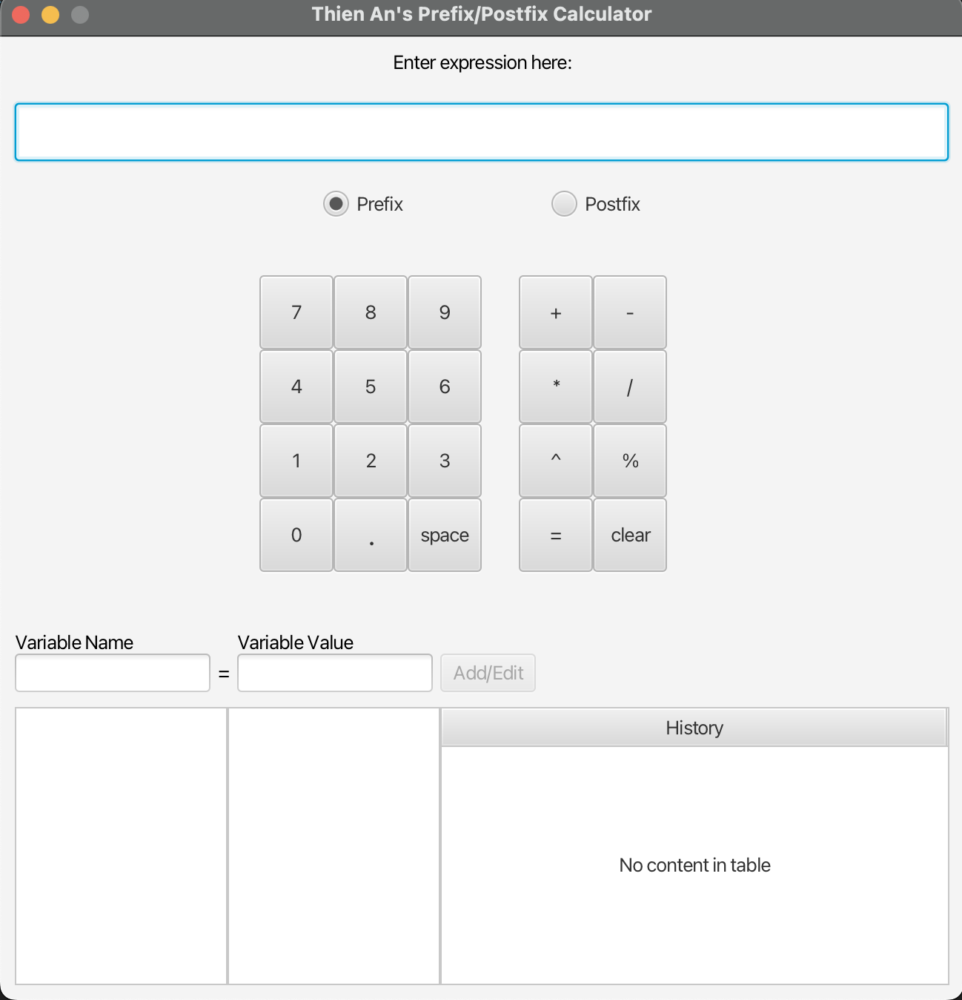

# PrefixPostfixCalculator

&nbsp;

Prefix/Postfix notation calculator created with JavaFX

# Installing
The JAR file ```PrefixPostfixCalc.jar``` is required to run the game.

# Running
The program can be run by double clicking on the JAR or from the command line using ```java -jar PrefixPostfixCalc.jar```.

# Overview

# Architecture & Design Patterns
